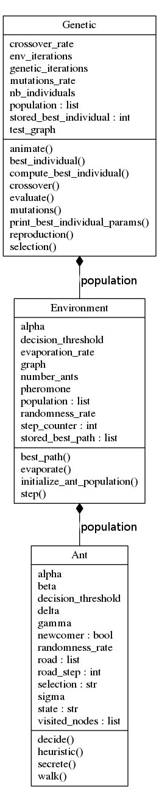

# Ant-colony-optimization
Python algorithm to find an optimized path through a graph

## Computation

*environment.py* embeds the class **environment**. This class is the one that should be used to compute the colony optimization. The method **step()** should be called every time you want to increment one step to your colony life. It performs various updates:

- Evaporates pheromones on the roads
- Ants secrete pheromones
- Ants walk one step
- If ants arrives in a new node, they choose a new road to follow. This decision can be random (to try new solutions) or based on the pheromone level of non visited roads. When ants reach food, they come back to their colony following the roads they took.

To initiate a new environment, the following parameters should be passed :

- **graph** : A 2D array containing distances between nodes. Every node corresponds to index of the array. Node 0 is always the colony and the last node is where the food is located.

- **number_ants** : Number of ants living in the environment.

- **evaporation_rate** : Rate of evaporation of pheromone on the roads. Pheromone is updated by multiplicating pheromone level on the road by (1 – evaporation_rate)

- **alpha** : Amount of pheromones left on road by every ants

- **randomness_rate** : Define the probability of random choice when ants arrive on a node

- **decision_threshold** : Define the probability of applying wether one decision formula or the other one .

To get best path, the method **best_path()** should be called. Best path is determined by choosing the road with maximum pheromone level at each node. It returns a list of nodes composing the path.

### Genetic mecanismes

We generate several environment with random parameters. Then we perform mutations, crossover and natural selection to select the environment settings that find the sortest path for a given graph. The class **Genetic** is the one that should be used to perform those genetic operations. The method **compute_best_individual()** of this class returns the selected environment that gave the best result during genetic operations.

### Graph UML
Below is the general structure of **environment.py**

## Graphical Modelling

The following description has to be red with the graphique.py file.

The first window we create manage the clicks of the user in order to create circles and lines to draw the graph. 

So, with the left click, we active the **draw-circle function** that save the position of the nods in the Nods matrix. 

With the right click, we active the **onclick_handler** which is creating a new line and when we release the mouse, we end this line.

To avoid some problems of position, we take the nearest node at the beginning and at the end of the click, so we're sure that a path is connecting two nods. It's the objective of the **Dist** matrix 

Finally we create a scale button to adapt the velocity of the ants. The problem is that the **newvalue** function is called only if we have displaced the cursor, so with the try/except structure, we test if the speed value is defined, if not we initiate the speed parameter at 1 .

**ConstructionGraph** modifies the **Graph** Matrix which is at the beginning only composed of 0. To this end, we browse the **Distance** Matrix and for each path, we replace the right value is the Graph Matrix. We can note that this matrix is clearly a symetric one.

To open the next window which permit the visualization of the ants, we have to close the previous one. So then, we can't create any circle or path anymore.

## Dynamic animation

The **start** function is linked with the START button, and this function turn the active global parameter to the True value. Then we've to know if it is the first time we click on the start button or if it's not. In the first case, we have to draw blue circles to figure Ants, in the second case, they aready exist, so we just pass. At the end we call the **anime** function, which manage the update of the position of evry ants while the active parameter is True. 

When we click on the stop button, we pass the ative parameter to the False value and so the active function is no longer called. So the ants are stopped. 

## Observations

Genetic mechanismes shows that a good colony is a colony with a non-zero **randomness-rate**. This means that some ants often make random decisions. This avoids ants to chase their tail and helps colonies to leave local minimums. Nevertheless, in dynamic animations the best path doesn't appears always clearly because random decisions make some ants to populate other path than the best one. Therefore one shoulds rather relies one the best past printed by the script instead of trying to find it by eye on the dynamic animation. Moreover the best path printed by the script is the one found by the best environment during gentic computations. However, the dynamic animation reset the population of the best environment selected. Consequently, the reseted colony might behave differently than the one that found the best path during genetic computation. That's why the printed best path will always be the good one and the best path displayed on dynamic animation might not.

